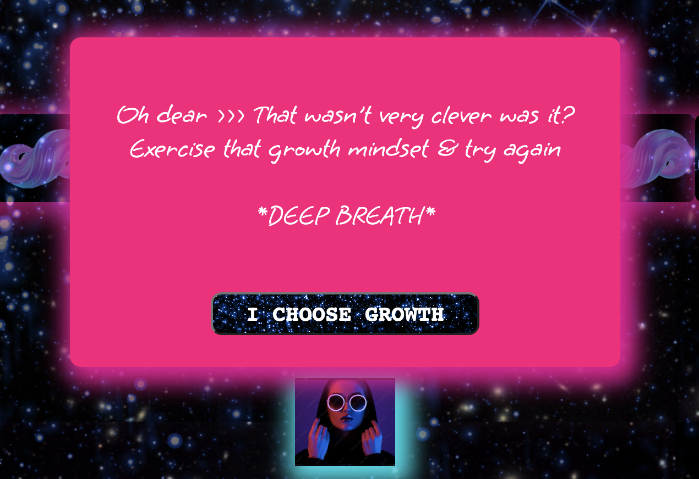
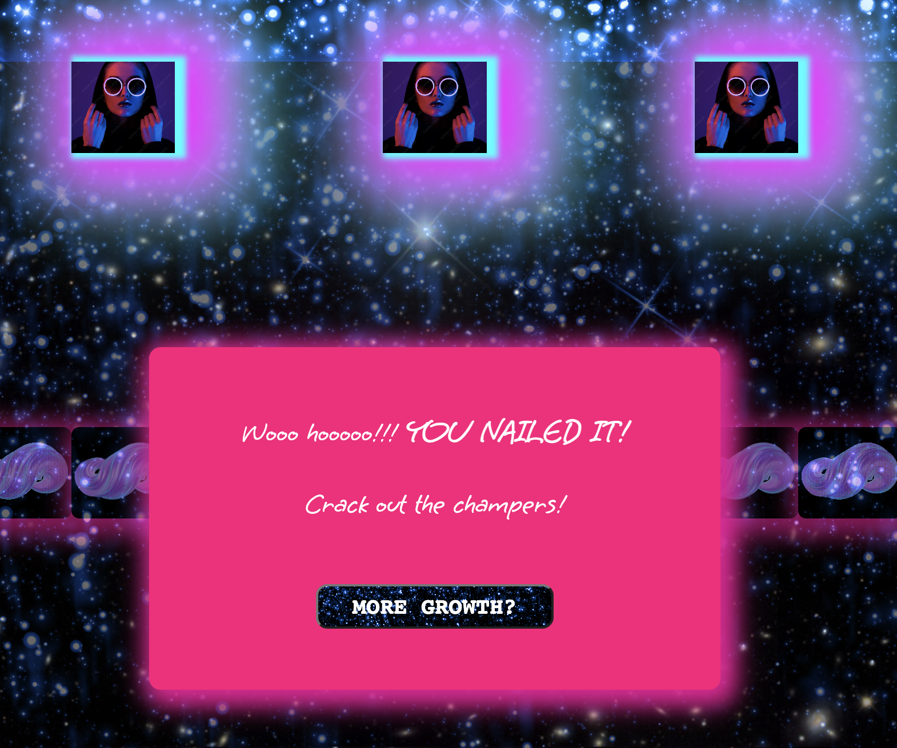

# General Assembly

# Project 1 - ‘Froggers in Space’
A modern version of the classic arcade game Frogger, in which Frogger, on a night out in Hackney, stumbles into a space/time vortex and needs your help finding her way back to her night out. The player must navigate 3 Froggers from their start positions passed glowing disco balls, black holes and rave zombies, to the star tunnels which will take them home. 

## [Play ’Froggers in space’?](https://fransurf.github.io/SEI-Project-ONE/)

## Brief
One week solo project to build a grid-based game using HTML, JavaScript and CSS. The game must: render in the browser; design logic & visual display for winning; use JavaScript for DOM manipulation; use semantic markup for HTML & CSS; contain auto-generated obstacles; be deployed online so that anyone can play it.

## Technologies
HTML:
* Title
* 3 pop-up overlays (intro; collision; win) with game-play buttons
* Minimal grid (layout created through JS)

CSS:
* Grid using flexbox
* Player & collider visual presentation
* Pop-up overlay visual presentation
* Buttons

JAVASCRIPT:
* Grid creation function
* Player, colliders & home positioning
* keyUp events for player movement controls functions
* setInterval functions to move colliders at set timings across the screen
* Collision functions, including removing and restarting colliders post-collision
* Start, restart and win functions
* Play & pause sound effects & music

## Approach taken
**Day 1** -  Built 11 x 11 grid using JS & flexbox; programmed keyboard directions using keyUp events; forbid movement beyond at grid edges; inserted character; programmed static collision ‘if’ statement; BIG WIN: collision popup overlay.
== INSERT IMAGE OF KEY MOVEMENT CODE HERE?? == 

**Day 2** - Worked long & hard on assigning class to divs (this grid-format would not be my first option); assigned class to colliders; blocked movement through colliders; wrote simple froggyHome function to produce a new Frogger at Start position; FRUSTRATION: making currentPosition follow next Frogger, rather than original Frogger; BIG WIN: Styling - I found a gorgeous blog on using box-shadow to produce glowing elements.

**Day 3** - Programmed collider movement using setInterval; solved currentPosition lingering after time had been removed; removed lingering Frogger plus colliders; reorganised/refactored code; began work on detailed froggyHome function; FRUSTRATION: struggling with getting homeFrogger to block movement of nextFrogger plus logic of 2 next Froggers.

**Day 4** - Programmed movement of collider in JS using cells function; win function & popup completed; close button class; remove Froggers from home if collision occurs.

**Day 5** - Lots of CSS styling to produce cool space theme; gifs for colliders and obstacles (in actuality these slow down loading); intro page overlay written & styled; music & audio for collisions etc added; BIG WIN: v pleased with funny loseAudio (no time to play your silly games).

**Day 6** - More colliders added; attempted a more sophisticated way of adding and controllers 3 types of collider (failed at this); some refactoring of code.

## Displays
**On page load (see above):** Opening overlay with game introduction displayed setting the scene & presenting instructions.

**On game start (see below):** Music plays (LCD Soundsystem); 1 ‘Frogger’ at a time appears center-bottom of screens; 3 auto-generated collider types (glowing disco ball gifs; black holes & rave zombies) move at 3 speeds; purple blob obstacles (undulating gifs) are impassable; 3 star tunnels at the top of the screen = home spots.

**On collision (see below, 1):** Collision audio plays; collision popup appears; option to restart; all characters returned to starting positions.
**On win (see below, 2):** Win audio plays; win popup appears; option to restart.

  
  

## Key Learnings
* Became very comfortable with styling using CSS
* Learned how to use Flex-box.
* Learned how to use JS for DOM manipulation
* Learned how to create pop-up messages using JS, HTML & CSS
* Learned how to use play() and pause() functions to control game audio

## Challenges
* Using JS created grid - I found it difficult to logically control characters around a grid that didn’t physically exist
* Disabling the previous Frogger once a new Frogger had been activated
* Disabling colliders on game restart after collision

## Wins
* I was pleased with the overall look & feel of the game
* The game-play was challenging & addictive
* The sound-effects, music & styling built a consistent environment which I feel fits well with the story presented in the introduction
## Future improvements
* I had wanted to provide the player with a choice of characters to play with 
Difficulty settings
## Bugs
* Currently, the previous rounds colliders remain if the player completes the game and decides to play again (which some friends have fortuitously mistaken as the next levels)!

